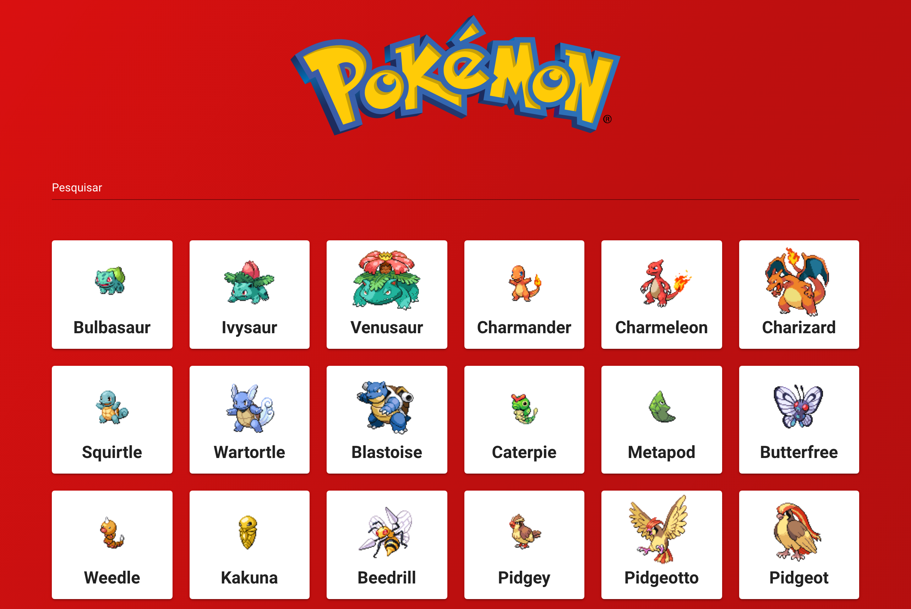
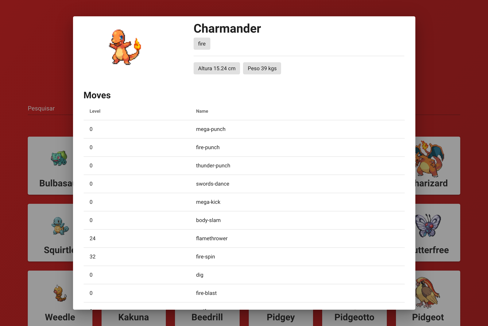

<h2 align="center">MINI POKÉDEX</h2>

<br>

<p align="center">Mini Pokédex criada com VueJS, utilizando a API <a href="https://pokeapi.co/">"pokeapi.co"</a>. Trazendo 150 pokémons com algumas informações sobre eles.</p>

<br><br>




<br><br>

## 🛠️ Tecnologias:
- VUEJS
- JAVASCRIPT
- VUETIFY

## 📍 Deploy:
- <a href="">CLIQUE AQUI PARA VER O PROJETO</a>

## 🌐 API:
- <a href="https://pokeapi.co/">pokeapi.co</a>

<br><br>


## 🖥️  CLONAR/RODAR PROJETO EM SEU DISPOSITIVO

<br>

```
git clone https://github.com/paulopariz/.git
```

```
cd mini-pokedex
```

```
yarn install
```

```
yarn serve
```

<br><br>


<h2 align="center">Contato:</h2>
<div align="center">

 <a href= "https://api.whatsapp.com/send?phone=5544999575376"></a> <a href="https://www.instagram.com/parizpaulo_/" style="margin-left:10px"></a> <a href="paulopariz01@gmail.com" style="margin-left:10px"></a> <a href="https://www.linkedin.com/in/paulopariz/" style="margin-left:10px"></a>

 </div>
